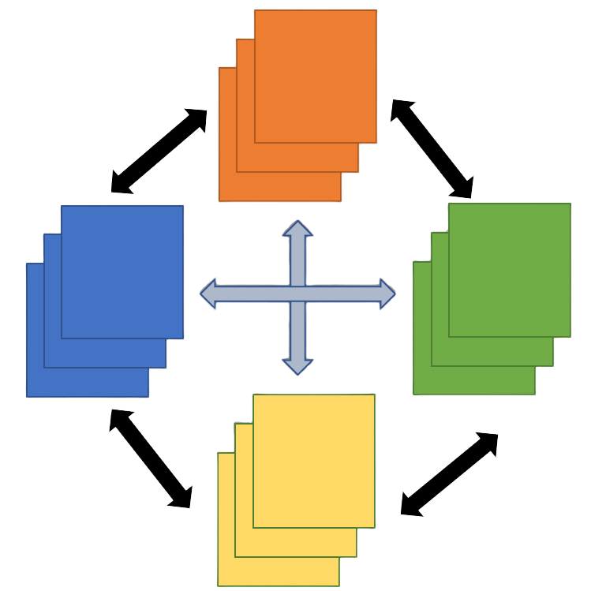

# Long Scene Manager Plugin

[中文文档](README_中文.md)

The Long Scene Manager is a Godot plugin designed to simplify and optimize the scene switching process, especially for complex scenes that require long loading times. It improves user experience by providing asynchronous scene loading, caching mechanisms, and customizable loading interfaces.

---


## Project Introduction

### Why Do You Need This Plugin?

Godot engine's built-in `preload()` function may have the following issues in certain cases:
- **Memory leak risk**: Preloaded resources may not be properly released
- **Main thread blocking**: Large scene preloading may affect game smoothness
- **Lack of cache management**: No built-in LRU cache eviction strategy
- **No loading interface support**: Cannot display custom loading screens during scene switching

**This plugin can serve as a perfect replacement for `preload()`**, and provides more advanced features:
- ✅ Fully asynchronous loading, non-blocking main thread
- ✅ Dual-layer LRU cache (instance cache + resource cache)
- ✅ Customizable loading screens (supports fade-in/fade-out effects)
- ✅ Multi-scene preload state tracking
- ✅ Scene reset functionality
- ✅ Complete debugging and monitoring support

---

## Support Me

If you find this plugin helpful for your project, please:

1. **Give this GitHub repository a Star**: [https://github.com/AWAUOX/GodotPlugin_LongSceneManager](https://github.com/AWAUOX/GodotPlugin_LongSceneManager)
2. **Mention this plugin's author in your game's credits**

Your support is my motivation to keep improving! (Please, I'm really tired doing this alone 😭😭😭)

---

## Latest Update (May 2026)

This update basically completes all planned features, including:

### GDScript Version
- ✅ Complete scene switching, preloading, cache management
- ✅ Scene reset functionality (`mark_scene_for_reset()` / `unmark_scene_for_reset()`)
- ✅ Multi-scene preload state tracking (`_preload_states` dictionary)
- ✅ Cross-multiple-frame scene instantiation (`instantiate_frames` parameter)
- ✅ Async/sync loading optional (`use_async_loading`)
- ✅ Complete signal system

### C# Version
- ✅ Fully aligned with GDScript version functionality
- ✅ Uses C#'s `async/await` pattern
- ✅ Proper Godot Signal delegate declarations (`[Signal]` attribute)
- ✅ Fixed resource cache issues (uses `ResourceLoader.CacheMode.Ignore`)
- ✅ Complete Chinese + English bilingual comments

### Issues Fixed
- Fixed compilation errors caused by duplicate method definitions
- Fixed issue with `PerformSceneSwitch` method missing
- Fixed `RemovePreloadedResource` and `RemoveCachedScene` methods missing
- Fixed issue with no black screen transition on first scene switch
- Fixed issue where resources couldn't be re-preloaded after removal

**The current update has fulfilled all functional requirements. If there are no fatal error or bugs in the future, no new features will be added, updates will only be made in accordance with the official version updates of Godot**

---

## Project Design Philosophy

### Architecture Design

```
LongSceneManager (AutoLoad Singleton)
│
├─ Scene Tree Management
│  ├─ Current active scene (_current_scene)
│  └─ Scene switch logic (SwitchScene)
│
├─ Dual-layer Cache System
│  ├─ Instance cache (_scene_cache) - Stores complete scene nodes
│  └─ Preload resource cache (_preload_resource_cache) - Stores PackedScene resources
│
├─ Preload Management
│  ├─ Multi-scene state tracking (_preload_states)
│  ├─ Async loading (ResourceLoader.ThreadedRequest)
│  └─ Sync loading (ResourceLoader.Load)
│
├─ Loading Screen Management
│  ├─ Default loading screen
│  └─ Custom loading screens
│
└─ Signal System
   ├─ Scene switch signals
   ├─ Preload signals
   └─ Cache management signals
```

### Core Design Principles

1. **Scene tree and cache separation**
   - Scene instances are either in the scene tree (currently active)
   - Or in the cache (inactive but retained in memory)
   - This design prevents scene nodes from existing in both places simultaneously

2. **LRU cache strategy**
   - Instance cache: Caches complete scene node instances
   - Preload resource cache: Only caches PackedScene resources (more memory efficient)
   - When cache reaches limit, automatically removes least recently used items

3. **Async priority**
   - Uses `ResourceLoader.ThreadedRequest` for async loading by default
   - Supports progress callbacks, can display progress bar on loading screen
   - Optional sync loading (set `use_async_loading = false`)

4. **Multi-scene preloading**
   - Uses dictionary to track multiple scenes' preload states
   - Supports preloading multiple scenes simultaneously
   - Each scene has independent loading state (NOT_LOADED / LOADING / LOADED)

---

## Images


## Basic Usage

### Installation Method

1. Copy the `addons/long_scene_manager` folder to your project's `addons` folder
2. Enable the plugin in Godot:
   - Go to `Project → Project Settings → Plugins`
   - Find "Long Scene Manager" and set its status to "Enable"

### Plugin Configuration

This plugin is implemented as a global autoload singleton. Depending on whether you want to use GDScript or C# implementation, you need to change the script path in the `plugin.cfg` file:

1. Open `addons/long_scene_manager/plugin.cfg`
2. Modify the `script` entry to point to GDScript or C# implementation:
   - For GDScript: `script="res://addons/long_scene_manager/autoload/long_scene_manager.gd"`
   - For C#: `script="res://addons/long_scene_manager/autoload/LongSceneManagerCs.cs"`
3. In Project Settings → Autoload, verify that the correct path is registered for the `LongSceneManager` singleton

---

### Scene Switching - Basic Usage

#### 1. Preload Scene (Background Advance Loading)

**GDScript Version**
```gdscript
# Preload scene to cache (background async loading, non-blocking)
LongSceneManager.preload_scene("res://scenes/level2.tscn")

# Can preload multiple scenes
LongSceneManager.preload_scenes([
    "res://scenes/level2.tscn",
    "res://scenes/level3.tscn"
])
```

**C# Version**
```csharp
var manager = (LongSceneManagerCs.LongSceneManagerCs)GetNode("/root/LongSceneManagerCs");

// Preload scene (background async loading)
manager.PreloadSceneGD("res://scenes/level2.tscn");

// Or use async method (C# only, can await completion)
await manager.PreloadScene("res://scenes/level2.tscn");
```

---

#### 2. Switch to Preloaded Scene (Using Cache)

**GDScript Version**
```gdscript
# Preload scene first
LongSceneManager.preload_scene("res://scenes/level2.tscn")

# Wait for preload to complete (optional, switches immediately if already preloaded)
await LongSceneManager.switch_scene(
    "res://scenes/level2.tscn", 
    true,   # Use cache
    ""      # Use default loading screen
)
# Will retrieve from preload resource cache, very fast
```

**C# Version**
```csharp
var manager = (LongSceneManagerCs.LongSceneManagerCs)GetNode("/root/LongSceneManagerCs");

// Preload scene first
manager.PreloadSceneGD("res://scenes/level2.tscn");

// Switch scene (uses cache, will retrieve from preload resource cache)
await manager.SwitchScene("res://scenes/level2.tscn", true, "");
```

---

#### 3. Direct Scene Switch Without Preload (No Cache)

**GDScript Version**
```gdscript
# Directly load and switch scene (don't use cache mechanism)
await LongSceneManager.switch_scene(
    "res://scenes/level2.tscn", 
    false,  # false = don't use cache
    ""     # Use default loading screen
)
# Scene will start loading immediately, won't enter cache after switch
```

**C# Version**
```csharp
var manager = (LongSceneManagerCs.LongSceneManagerCs)GetNode("/root/LongSceneManagerCs");

// Direct scene switch (don't use cache)
await manager.SwitchScene("res://scenes/level2.tscn", false, "");
```

---

#### 4. Use Custom Transition Scene (Loading Screen)

**GDScript Version**
```gdscript
# Use custom loading screen for scene switching
await LongSceneManager.switch_scene(
    "res://scenes/level2.tscn", 
    true,                       # Use cache
    "res://ui/my_load_screen.tscn"  # Custom loading screen path
)
# Custom loading screen should implement fade_in(), fade_out() etc. to control transition effects
```

**C# Version**
```csharp
var manager = (LongSceneManagerCs.LongSceneManagerCs)GetNode("/root/LongSceneManagerCs");

// Use custom loading screen
await manager.SwitchScene(
    "res://scenes/level2.tscn", 
    true,                        
    "res://ui/my_load_screen.tscn"  // Custom loading screen path
);
```

**Custom loading screen methods to implement**:
```gdscript
# In custom loading screen scene, you can implement these methods:
extends CanvasLayer

func fade_in():
    # Fade-in effect (show loading screen)
    print("Fade in started")
    await get_tree().create_timer(0.5).timeout
    print("Fade in completed")

func fade_out():
    # Fade-out effect (hide loading screen)
    print("Fade out started")
    await get_tree().create_timer(0.5).timeout
    print("Fade out completed")

func set_progress(progress: float):
    # Update progress bar (optional)
    $ProgressBar.value = progress * 100
```

---

#### 5. Use Default Transition Scene (Loading Screen)

**GDScript Version**
```gdscript
# Use default loading screen (black background + "Loading..." text)
await LongSceneManager.switch_scene(
    "res://scenes/level2.tscn", 
    true,  # Use cache
    ""    # Empty string = use default loading screen
)
# Default loading screen will auto fade-in and fade-out
```

**C# Version**
```csharp
var manager = (LongSceneManagerCs.LongSceneManagerCs)GetNode("/root/LongSceneManagerCs");

// Use default loading screen
await manager.SwitchScene("res://scenes/level2.tscn", true, "");

// Or use GDScript compatible method
manager.SwitchSceneGD("res://scenes/level2.tscn", true, "");
```

---

#### 6. Don't Use Transition Scene (No Transition, Quick Switch)

**GDScript Version**
```gdscript
# Force not using any loading screen, scene switches immediately (no fade-in/out)
await LongSceneManager.switch_scene(
    "res://scenes/level2.tscn", 
    true,
    "no_transition"  # Special value, means no transition
)
# Suitable for quick scene switching, or when you control transition effects yourself
```

**C# Version**
```csharp
var manager = (LongSceneManagerCs.LongSceneManagerCs)GetNode("/root/LongSceneManagerCs");

// Don't use transition scene
await manager.SwitchScene("res://scenes/level2.tscn", true, "no_transition");

// Or use GDScript compatible method
manager.SwitchSceneGD("res://scenes/level2.tscn", true, "no_transition");
```

---

### Scene Preloading - Advanced Management

#### GDScript Version
```gdscript
# Preload multiple scenes at once
LongSceneManager.preload_scenes([
    "res://scenes/level3.tscn",
    "res://scenes/level4.tscn"
])

# Cancel preloading (if in progress)
LongSceneManager.cancel_preload_scene("res://scenes/level3.tscn")

# Cancel all ongoing preloads
LongSceneManager.cancel_all_preloads()

# Get preload progress (0.0 - 1.0)
var progress = LongSceneManager.get_loading_progress("res://scenes/level3.tscn")
print("Loading progress: ", progress * 100, "%")

# Check if scene is currently preloading
if LongSceneManager.is_scene_preloading("res://scenes/level3.tscn"):
    print("Scene is preloading...")
```

#### C# Version
```csharp
var manager = (LongSceneManagerCs.LongSceneManagerCs)GetNode("/root/LongSceneManagerCs");

// Preload multiple scenes (call in loop)
string[] scenesToPreload = {
    "res://scenes/level3.tscn",
    "res://scenes/level4.tscn"
};
foreach (var scene in scenesToPreload)
{
    manager.PreloadSceneGD(scene);
}

// Cancel preloading
manager.CancelPreloadScene("res://scenes/level3.tscn");

// Cancel all ongoing preloads
manager.CancelAllPreloads();

// Get preload progress (0.0 - 1.0)
float progress = manager.GetLoadingProgress("res://scenes/level3.tscn");
GD.Print($"Loading progress: {progress * 100}%");
```

---

## Advanced Usage

### 1. Cache Management - Detailed Examples

The cache system has **two layers**: Instance cache (stores complete scene nodes) + Preload resource cache (stores PackedScene resources).

#### GDScript Version
```gdscript
# Get cache details (for debugging and monitoring)
var cache_info = LongSceneManager.get_cache_info()
print("Current scene: ", cache_info.current_scene)
print("Previous scene: ", cache_info.previous_scene)
print("Instance cache count: ", cache_info.instance_cache.size, "/", cache_info.instance_cache.max_size)
print("Preload cache count: ", cache_info.preload_cache.size, "/", cache_info.preload_cache.max_size)

# Iterate through scenes in instance cache
for item in cache_info.instance_cache.scenes:
    print("Cached scene: ", item.path, " Cache time: ", item.cached_time)

# Iterate through scenes in preload resource cache
for scene_path in cache_info.preload_cache.scenes:
    print("Preload resource: ", scene_path)

# Dynamically adjust cache size (⚠️ Note: Try to determine size at start, avoid runtime changes)
LongSceneManager.set_max_cache_size(10)       # Instance cache max 10 scenes
LongSceneManager.set_max_preload_resource_cache_size(30)  # Preload resource cache max 30

# Clear all caches (instance cache + preload resource cache)
LongSceneManager.clear_cache()
print("All caches cleared")

# Only remove preloaded resource (doesn't affect instance cache)
LongSceneManager.remove_preloaded_resource("res://scenes/level3.tscn")
print("Preloaded resource removed")

# Only remove cached scene instance (doesn't affect preload resource cache)
LongSceneManager.remove_cached_scene("res://scenes/level3.tscn")
print("Cached scene instance removed")

# Check if scene is already in any cache
if LongSceneManager.is_scene_cached("res://scenes/level3.tscn"):
    print("Scene already cached")

# Get list of currently preloading scenes
var loading = LongSceneManager.get_preloading_scenes()
if loading.size() > 0:
    print("Currently preloading scenes: ", loading)
```

#### C# Version
```csharp
var manager = (LongSceneManagerCs.LongSceneManagerCs)GetNode("/root/LongSceneManagerCs");

// Get cache details (for debugging and monitoring)
var cacheInfo = manager.GetCacheInfo();
GD.Print($"Current scene: {cacheInfo["current_scene"]}");
GD.Print($"Previous scene: {cacheInfo["previous_scene"]}");

// Instance cache info
var instanceCache = (Godot.Collections.Dictionary)cacheInfo["instance_cache"];
GD.Print($"Instance cache count: {instanceCache["size"]} / {instanceCache["max_size"]}");

// Preload resource cache info
var preloadCache = (Godot.Collections.Dictionary)cacheInfo["preload_cache"];
GD.Print($"Preload cache count: {preloadCache["size"]} / {preloadCache["max_size"]}");

// Dynamically adjust cache size (⚠️ Note: Try to determine size at start, avoid runtime changes)
manager.SetMaxCacheSize(10);       // Instance cache max 10 scenes
manager.SetMaxPreloadResourceCacheSize(30);  // Preload resource cache max 30;

// Clear all caches (instance cache + preload resource cache)
manager.ClearCache();
GD.Print("All caches cleared");

// Only remove preloaded resource (doesn't affect instance cache)
manager.RemovePreloadedResource("res://scenes/level3.tscn");
GD.Print("Preloaded resource removed");

// Only remove cached scene instance (doesn't affect preload resource cache)
manager.RemoveCachedScene("res://scenes/level3.tscn");
GD.Print("Cached scene instance removed");

// Check if scene is already in any cache
if (manager.IsSceneCached("res://scenes/level3.tscn"))
{
    GD.Print("Scene already cached");
}

// Get list of currently preloading scenes
var preloading = manager.GetPreloadingScenes();
if (preloading.Count > 0)
{
    GD.Print($"Currently preloading scenes count: {preloading.Count}");
}
```

**LRU Cache Eviction Policy**:
- When cache reaches limit, automatically removes **least recently used** cache items
- Instance cache: When removing, scene instance will be `queue_free()`d
- Preload resource cache: When removing, only deletes from dictionary, doesn't release resource (Godot manages automatically)

---

### 2. Scene Reset Functionality - Detailed Examples

The scene reset function is used for **force refresh scenes**. When you mark a scene for reset, it won't enter cache when removed from scene tree, but will be freed and reloaded as a preload resource.

#### Use Cases
Player death requires level reload, scene state needs complete reset, etc.

#### GDScript Version
```gdscript
# Mark scene to reset on next switch
# Example: After player death, mark current level for reset
LongSceneManager.mark_scene_for_reset("res://scenes/level3.tscn")
print("Scene marked for reset")

# When switching scenes (e.g., back to main menu), the scene will:
# 1. Be removed from scene tree
# 2. Not enter instance cache
# 3. Be freed (queue_free())
# 4. Be reloaded as resource to preload cache

# Cancel mark (if player revived, don't need reset)
LongSceneManager.unmark_scene_for_reset("res://scenes/level3.tscn")
print("Scene reset mark cancelled")

# Check if scene is marked for reset
if LongSceneManager._scenes_to_reset.has("res://scenes/level3.tscn"):
    print("Scene marked for reset, will refresh on next switch")
```

#### C# Version
```csharp
var manager = (LongSceneManagerCs.LongSceneManagerCs)GetNode("/root/LongSceneManagerCs");

// Mark scene to reset on next switch
manager.MarkSceneForReset("res://scenes/level3.tscn");
GD.Print("Scene marked for reset");

// When switching scenes, the scene will:
// 1. Be removed from scene tree
// 2. Not enter instance cache
// 3. Be freed (QueueFree())
// 4. Be reloaded as resource to preload cache

// Cancel mark
manager.UnmarkSceneForReset("res://scenes/level3.tscn");
GD.Print("Scene reset mark cancelled");

// Check if scene is marked for reset
// Note: _scenesToReset is internal field, not recommended to access directly
// Can check if scene is in cache to determine
if (!manager.IsSceneCached("res://scenes/level3.tscn"))
{
    GD.Print("Scene not in cache, possibly marked for reset");
}
```

**How It Works**:
1. After calling `mark_scene_for_reset()`, scene path is recorded to `_scenes_to_reset` dictionary
2. When scene is removed from scene tree (scene switch), check if there's a reset mark
3. If marked: Free scene instance + reload as resource to preload cache
4. Reset mark only takes effect **once**, then auto-clears

**Use Cases**:
- ✅ Player death requires level reload
- ✅ Scene state needs complete refresh
- ✅ Testing scene reload logic
- ❌ Don't use for scenes that need to preserve state

---

### 3. Custom Loading Screens - Detailed Examples

Custom loading screens can give your game unique transition effects.

#### Creating Custom Loading Screen (GDScript)

**Step 1: Create Scene File**
```
MyLoadScreen.tscn
└── CanvasLayer (root node)
    ├── ColorRect (full-screen background)
    ├── Label (hint text)
    └── ProgressBar (progress bar, optional)
```

**Step 2: Write Script `my_load_screen.gd`**
```gdscript
extends CanvasLayer

func fade_in():
    print("Custom loading screen: Fade in started")
    
    # Set initial state (fully transparent)
    modulate.a = 0.0
    
    # Use Tween to implement fade-in animation
    var tween = get_tree().create_tween()
    tween.tween_property(self, "modulate:a", 1.0, 0.5)
    await tween.finished
    
    print("Custom loading screen: Fade in completed")

func fade_out():
    print("Custom loading screen: Fade out started")
    
    # Use Tween to implement fade-out animation
    var tween = get_tree().create_tween()
    tween.tween_property(self, "modulate:a", 0.0, 0.5)
    await tween.finished
    
    print("Custom loading screen: Fade out completed")

func set_progress(progress: float):
    if has_node("ProgressBar"):
        $ProgressBar.value = progress * 100.0
        print("Loading progress: ", progress * 100, "%")

# Or use show_loading / hide_loading method names
func show_loading():
    print("Custom loading screen: Show")
    visible = true
    modulate.a = 1.0

func hide_loading():
    print("Custom loading screen: Hide")
    visible = false
```

#### Using Custom Loading Screen (GDScript)

```gdscript
# Method 1: Specify during scene switch
await LongSceneManager.switch_scene(
    "res://scenes/level2.tscn", 
    true,                        # Use cache
    "res://ui/my_load_screen.tscn"  # Custom loading screen path
)
# Custom loading screen will auto fade-in and fade-out

# Method 2: Set always_use_default_load_screen, will ignore custom settings
# In editor settings, or through code:
LongSceneManager.always_use_default_load_screen = false
```

**Notes**:
- ✅ Custom loading screen will auto fade-in and fade-out
- ✅ If `set_progress` method is implemented, progress will be auto-updated during preload
- ✅ If custom loading screen fails to load, will fallback to default loading screen
- ❌ Custom loading screen will **NOT** be cached, reloads every time

---

#### Creating Custom Loading Screen (C#)

**Step 1: Create Scene File** (same as above)

**Step 2: Write Script `MyLoadScreenCs.cs`**
```csharp
using Godot;

public partial class MyLoadScreenCs : CanvasLayer
{
    private ProgressBar progressBar;

    public override void _Ready()
    {
        progressBar = GetNode<ProgressBar>("ProgressBar");
    }

    // Fade-in effect (show loading screen)
    public async void FadeIn()
    {
        GD.Print("Custom loading screen: Fade in started");
        
        // Set initial state (fully transparent)
        Modulate = new Color(Modulate.R, Modulate.G, Modulate.B, 0.0f);
        
        // Use Tween to implement fade-in animation
        var tween = GetTree().CreateTween();
        tween.TweenProperty(this, "modulate:a", 1.0f, 0.5f);
        await ToSignal(tween, "finished");
        
        GD.Print("Custom loading screen: Fade in completed");
    }

    // Fade-out effect (hide loading screen)
    public async void FadeOut()
    {
        GD.Print("Custom loading screen: Fade out started");
        
        // Use Tween to implement fade-out animation
        var tween = GetTree().CreateTween();
        tween.TweenProperty(this, "modulate:a", 0.0f, 0.5f);
        await ToSignal(tween, "finished");
        
        GD.Print("Custom loading screen: Fade out completed");
    }

    // Update progress (optional)
    public void SetProgress(float progress)
    {
        if (progressBar != null)
        {
            progressBar.Value = progress * 100.0f;
            GD.Print($"Loading progress: {progress * 100}%");
        }
    }
}
```

#### Using Custom Loading Screen (C#)

```csharp
var manager = (LongSceneManagerCs.LongSceneManagerCs)GetNode("/root/LongSceneManagerCs");

// Use custom loading screen
await manager.SwitchScene(
    "res://scenes/level2.tscn", 
    true,                        
    "res://ui/my_load_screen.tscn"  // Custom loading screen path
);
```

---

### 4. Cross-Multiple-Frame Instantiation - Detailed Examples

For complex scenes with many nodes, you can use multi-frame instantiation to avoid stuttering. The principle is to spread the scene instantiation process across multiple frames.

#### GDScript Version
```gdscript
# Method 1: Set instantiate_frames parameter in editor (1-10)
# Select LongSceneManager node, set Instantiate Frames in inspector

# Method 2: Or set dynamically in code
LongSceneManager.instantiate_frames = 5  # Spread instantiation across 5 frames

# Scene will auto use multi-frame instantiation when switching
await LongSceneManager.switch_scene("res://scenes/heavy_scene.tscn")

# Principle:
# - Only process part of nodes per frame (set process = false)
# - After all processed, restore all nodes' process state
# - Avoid single-frame processing causing stutter
```

#### C# Version
```csharp
var manager = (LongSceneManagerCs.LongSceneManagerCs)GetNode("/root/LongSceneManagerCs");

// Set to spread instantiation across 5 frames
manager.Set("instantiate_frames", 5);

// Or use property access (if property is exposed)
// manager.InstantiateFrames = 5;

// Scene will auto use multi-frame instantiation when switching
await manager.SwitchScene("res://scenes/heavy_scene.tscn");
```

**Use Cases**:
- ✅ Complex 3D scenes with many nodes
- ✅ Scenes needing instantiation with 100+ nodes
- ✅ Single-frame instantiation causing noticeable stutter
- ❌ Simple scenes (no need to use)

**Parameter Description**:
| instantiate_frames Value | Effect |
|-------------------|--------|
| 1 | Single-frame instantiation (no optimization) |
| 3-5 | Light optimization, suitable for medium complexity scenes |
| 6-10 | Heavy optimization, suitable for very complex scenes |

---

### 5. Signal Connections - Detailed Examples

The plugin provides **9 signals** for monitoring scene switches, preloading, and cache status.

#### GDScript Version
```gdscript
func _ready():
    # Connect all scene manager signals
    LongSceneManager.scene_switch_started.connect(_on_scene_switch_started)
    LongSceneManager.scene_switch_completed.connect(_on_scene_switch_completed)
    LongSceneManager.scene_preload_started.connect(_on_preload_started)
    LongSceneManager.scene_preload_completed.connect(_on_preload_completed)
    LongSceneManager.scene_preload_failed.connect(_on_preload_failed)
    LongSceneManager.scene_switch_failed.connect(_on_switch_failed)
    LongSceneManager.scene_cached.connect(_on_scene_cached)
    LongSceneManager.scene_removed_from_cache.connect(_on_scene_removed)
    LongSceneManager.load_screen_shown.connect(_on_load_screen_shown)
    LongSceneManager.load_screen_hidden.connect(_on_load_screen_hidden))

# Scene switch signals
func _on_scene_switch_started(from_scene: String, to_scene: String):
    print("Scene switch started: ", from_scene, " -> ", to_scene)

func _on_scene_switch_completed(scene_path: String):
    print("Scene switch completed: ", scene_path)
    # Can update UI, play sound effects here

func _on_scene_switch_failed(scene_path: String):
    push_error("Scene switch failed: ", scene_path)
    # Can show error prompt here

# Preload signals
func _on_preload_started(scene_path: String):
    print("Scene preload started: ", scene_path)

func _on_preload_completed(scene_path: String):
    print("Scene preload completed: ", scene_path)
    # Can update UI here, prompt player can switch now

func _on_preload_failed(scene_path: String):
    push_error("Scene preload failed: ", scene_path)

# Cache signals
func _on_scene_cached(scene_path: String):
    print("Scene cached: ", scene_path)

func _on_scene_removed(scene_path: String):
    print("Scene removed from cache: ", scene_path)

# Loading screen signals
func _on_load_screen_shown(load_screen_instance: Node):
    print("Loading screen shown: ", load_screen_instance.name)

func _on_load_screen_hidden(load_screen_instance: Node):
    print("Loading screen hidden: ", load_screen_instance.name)
```

#### C# Version
```csharp
public override void _Ready()
{
    var manager = (LongSceneManagerCs.LongSceneManagerCs)GetNode("/root/LongSceneManagerCs");
    
    // Connect all scene manager signals
    manager.SceneSwitchStarted += OnSceneSwitchStarted;
    manager.SceneSwitchCompleted += OnSceneSwitchCompleted;
    manager.ScenePreloadStarted += OnScenePreloadStarted;
    manager.ScenePreloadCompleted += OnScenePreloadCompleted;
    manager.ScenePreloadFailed += OnScenePreloadFailed;
    manager.SceneSwitchFailed += OnSceneSwitchFailed;
    manager.SceneCached += OnSceneCached;
    manager.SceneRemovedFromCache += OnSceneRemoved;
    manager.LoadScreenShown += OnLoadScreenShown;
    manager.LoadScreenHidden += OnLoadScreenHidden;
}

// Scene switch signals
private void OnSceneSwitchStarted(string fromScene, string toScene)
{
    GD.Print($"Scene switch started: {fromScene} -> {toScene}");
}

private void OnSceneSwitchCompleted(string scenePath)
{
    GD.Print($"Scene switch completed: {scenePath}");
    // Can update UI, play sound effects here
}

private void OnSceneSwitchFailed(string scenePath)
{
    GD.PrintErr($"Scene switch failed: {scenePath}");
    // Can show error prompt here
}

// Preload signals
private void OnScenePreloadStarted(string scenePath)
{
    GD.Print($"Scene preload started: {scenePath}");
}

private void OnScenePreloadCompleted(string scenePath)
{
    GD.Print($"Scene preload completed: {scenePath}");
    // Can update UI here, prompt player can switch now
}

private void OnScenePreloadFailed(string scenePath)
{
    GD.PrintErr($"Scene preload failed: {scenePath}");
}

// Cache signals
private void OnSceneCached(string scenePath)
{
    GD.Print($"Scene cached: {scenePath}");
}

private void OnSceneRemoved(string scenePath)
{
    GD.Print($"Scene removed from cache: {scenePath}");
}

// Loading screen signals
private void OnLoadScreenShown(Node loadScreenInstance)
{
    GD.Print($"Loading screen shown: {loadScreenInstance.Name}");
}

private void OnLoadScreenHidden(Node loadScreenInstance)
{
    GD.Print($"Loading screen hidden: {loadScreenInstance.Name}");
}
```

**Signal Use Cases**:
- ✅ **Scene switch started**: Show "Loading..." UI
- ✅ **Scene switch completed**: Hide loading UI, play enter sound
- ✅ **Preload completed**: Enable scene switch button
- ✅ **Scene cached**: Update cache status display
- ✅ **Loading screen shown/hidden**: Sync other system states

---

## Notes

### 1. Cache Behavior

- **First scene switch won't use cache** (because cache is empty)
- **When switching from cache, scene instance will be removed from cache**, then added to scene tree
- **When scene enters cache**: When removed from scene tree, if cache enabled and not marked for reset
- **LRU eviction**: When cache reaches limit, least recently used scenes are automatically removed

### 2. Preload Notes

- **Preloading is asynchronous**: `preload_scene()` returns immediately, non-blocking
- **After preload completes, resource enters preload resource cache**
- **If scene is already in cache when preloading**: Will output warning and ignore request
- **When removing preloaded resource**: Will also clear preload state, allowing re-preload
- **C# version uses `CacheMode.Ignore`**: Ensures reload every time, avoids using Godot internal cache

### 3. Loading Screen Notes

- **Default loading screen**: If no loading screen path specified, uses default black loading screen
- **Custom loading screens**: Need to be valid Godot scenes, should implement `fade_in`, `fade_out` etc. methods
- **No transition mode**: Using `"no_transition"` as loading screen path will skip loading screen display
- **First switch no black screen**: If no loading screen on first switch, check if default loading screen initialized correctly

### 4. C# Version Special Notes

- **Namespace conflict**: Namespace and class name are both `LongSceneManagerCs`, need to use full name: `LongSceneManagerCs.LongSceneManagerCs`
- **GDScript compatible methods**: Use `SwitchSceneGD()` and `PreloadSceneGD()` to call C# version from GDScript
- **Async methods**: C# version supports true `async/await`, can use `SwitchScene()` and `PreloadScene()` async methods

### 5. Scene Reset Notes

- **After marking reset**: Scene won't enter cache, but will be freed and reloaded as preload resource
- **Only affects next switch**: Scene reset mark only takes effect once, then auto-clears
- **Can be used for force refresh**: E.g., level reload needed after player death

---

## API Reference

### Scene Switching Methods

| Method | Description |
|--------|-------------|
| `switch_scene(scene_path, use_cache=true, load_screen_path="")` | Switch to new scene, optionally use cache and custom loading screen |
| `switch_scene_gd(scene_path, use_cache=true, load_screen_path="")` | GDScript compatible scene switch wrapper |

### Preload Methods

| Method | Description |
|--------|-------------|
| `preload_scene(scene_path)` | Preload scene to cache |
| `preload_scene_gd(scene_path)` | GDScript compatible scene preload wrapper |
| `preload_scenes(scene_paths)` | Preload multiple scenes at once |
| `cancel_preload_scene(scene_path)` | Cancel scene preloading |
| `cancel_all_preloads()` | Cancel all ongoing scene preloads |

### Cache Management Methods

| Method | Description |
|--------|-------------|
| `clear_cache()` | Clear all cached scenes and preloaded resources |
| `get_cache_info()` | Get detailed information about current cache status |
| `is_scene_cached(scene_path)` | Check if scene is currently cached |
| `set_max_cache_size(new_size)` | Set maximum number of scenes that can be cached |
| `set_max_preload_resource_cache_size(new_size)` | Set maximum number of preloaded resources that can be cached |
| `remove_preloaded_resource(scene_path)` | Only remove preloaded resource cache |
| `remove_cached_scene(scene_path)` | Only remove cached scene instance |
| `get_loading_progress(scene_path)` | Get scene loading progress (0.0 to 1.0) |

### Scene Reset Methods

| Method | Description |
|--------|-------------|
| `mark_scene_for_reset(scene_path)` | Mark scene to reset on next switch |
| `unmark_scene_for_reset(scene_path)` | Cancel scene reset mark |

### Utility Methods

| Method | Description |
|--------|-------------|
| `get_current_scene()` | Get current scene instance |
| `get_previous_scene_path()` | Get path of previous scene |
| `get_preloading_scenes()` | Get list of currently preloading scenes |
| `print_debug_info()` | Print debug information to console |

---

## Signal List

| Signal | Description |
|--------|-------------|
| `scene_preload_started(scene_path)` | Emitted when scene preload starts |
| `scene_preload_completed(scene_path)` | Emitted when scene preload completes |
| `scene_preload_failed(scene_path)` | Emitted when scene preload fails |
| `scene_switch_started(from_scene, to_scene)` | Emitted when scene switch begins |
| `scene_switch_completed(scene_path)` | Emitted when scene switch completes |
| `scene_switch_failed(scene_path)` | Emitted when scene switch fails |
| `scene_cached(scene_path)` | Emitted when scene is added to cache |
| `scene_removed_from_cache(scene_path)` | Emitted when scene is removed from cache |
| `load_screen_shown(load_screen_instance)` | Emitted when loading screen is shown |
| `load_screen_hidden(load_screen_instance)` | Emitted when loading screen is hidden |

---

## Configuration Options

The plugin exposes several configuration options that can be adjusted in the editor:

| Option | Type | Default | Range | Description |
|--------|------|---------|-------|-------------|
| `max_cache_size` | int | 8 | 1-20 | Maximum number of scenes to cache |
| `max_preload_resource_cache_size` | int | 20 | 1-50 | Maximum number of preloaded resources to cache |
| `use_async_loading` | bool | true | - | Whether to use asynchronous loading |
| `always_use_default_load_screen` | bool | false | - | Always use default loading screen |
| `instantiate_frames` | int | 3 | 1-10 | Number of frames to spread scene instantiation across |

---

## Troubleshooting

### Scene Preload Issues

If you're having trouble with scene preloading after clearing the cache, make sure you're using the latest version of the plugin, which properly resets loading state when clearing cache.

**C# Version Special Note**: C# version uses `ResourceLoader.CacheMode.Ignore` during preloading, ensuring resources are reloaded every time, avoiding Godot internal cache.

### Cache Not Working

Ensure that the `use_cache` parameter is set to `true` when switching scenes if you want to take advantage of the caching mechanism.

### Custom Loading Screens

When creating custom loading screens, make sure they inherit from valid Godot node types, and implement the expected methods (e.g., `fade_in`, `fade_out`, etc.) if you plan to use them.

### First Switch No Black Screen

If there's no black screen transition on first scene switch, please check:
1. Is default loading screen initialized correctly (check console output)
2. Is `always_use_default_load_screen` set to `false`
3. Is loading screen instance `null`

### C# Version Compilation Errors

If you encounter compilation errors, please check:
1. Are you referencing the `LongSceneManagerCs` namespace correctly?
2. Are you using the full type name `LongSceneManagerCs.LongSceneManagerCs`?
3. Do all required methods exist (e.g., `RemovePreloadedResource`, `RemoveCachedScene`, etc.)?

---

## Project Structure

```
addons/long_scene_manager/
├── plugin.cfg                    # Plugin configuration file
├── autoload/
│   ├── long_scene_manager.gd    # GDScript implementation
│   └── LongSceneManagerCs.cs    # C# implementation
├── ui/
│   ├── loading_screen/
│   │   ├── GDScript/
│   │   │   └── loading_black_screen.tscn  # GDScript default loading screen
│   │   └── CSharp/
│   │       └── loading_black_screen_cs.tscn  # C# default loading screen
│   └── ...
├── image_icon/                  # Plugin icons
└── ...

demo_test_scene_manager/         # Test project
├── main_scene.tscn
├── main_scene_script/
│   ├── main_scene_gd.gd
│   └── MainSceneCs.cs
├── test_scene_1.tscn
├── test_scene_1_script/
│   ├── test_scene_1_gd.gd
│   └── TestScene1Cs.cs
├── test_scene_2.tscn
├── test_scene_2_script/
│   ├── test_scene_2_gd.gd
│   └── TestScene2Cs.cs
└── ...
```

---

## License

This plugin is licensed under the MIT License. You are free to use, modify, and distribute this plugin.

---

## Acknowledgments

Thanks to all developers who provided feedback and suggestions!

**Special thanks to**:
- Godot community
- All developers who gave this plugin a Star
- Developers who mention this plugin author in game credits

---

**Last updated**: May 2026
