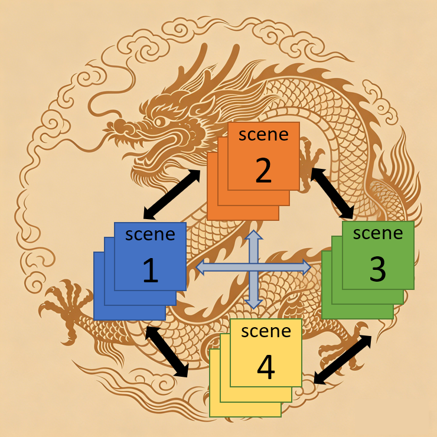
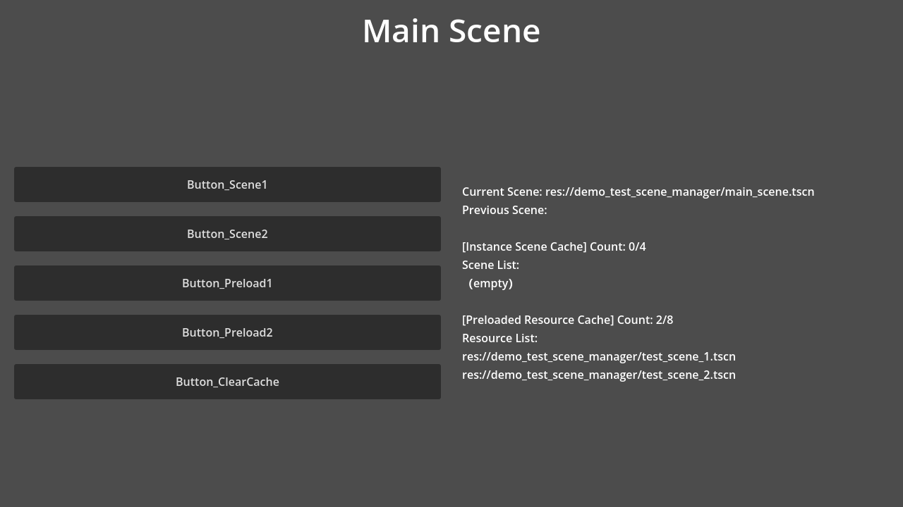
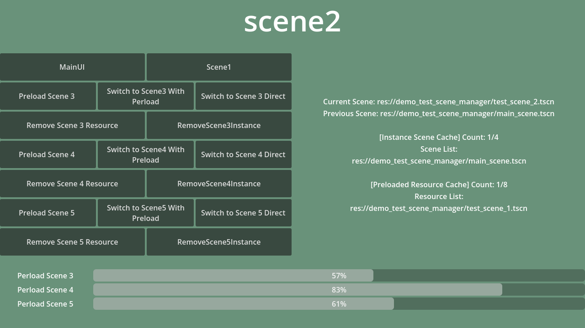
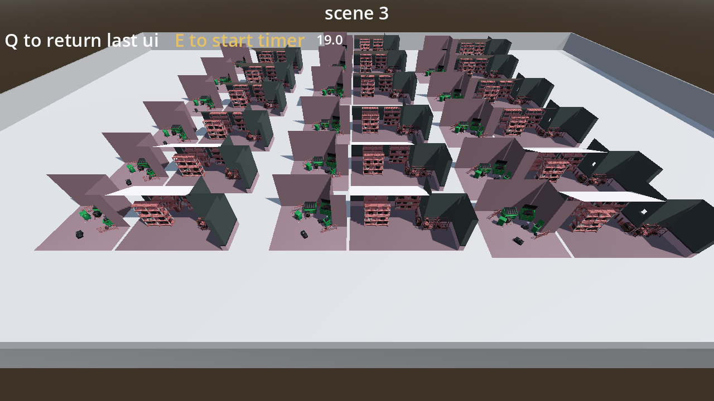

# Long Scene Manager Plugin

[中文文档](README_中文.md)

Long Scene Manager is a Godot 4.x plugin designed to simplify and optimize the scene switching process, especially for complex scenes that require long loading times. It improves user experience by providing asynchronous scene loading, a three-tier caching system, and customizable loading interfaces.

---



---

> **⚠️ About the C# Version**: The C# version has been paused and remains at v1.5. The main reason is that Godot's C# API support is currently quite inconsistent, making solo development difficult. After actual testing and comparison, the C# version offers almost no advantage over the GDScript version in terms of performance and stability. Therefore, development efforts are now focused on maintaining the GDScript version. If you need the C# version, you can check the historical versions in the repository, but no further updates will be provided.

---

## Table of Contents

- [Why Do You Need This Plugin?](#why-do-you-need-this-plugin)
- [Support the Developer](#support-the-developer)
- [Installation](#installation)
- [Plugin Configuration (Exported Variables)](#plugin-configuration-exported-variables)
- [Core Concepts](#core-concepts)
  - [Five-State Machine (LoadState)](#five-state-machine-loadstate)
  - [Five Loading Strategies (LoadMethod)](#five-loading-strategies-loadmethod)
  - [Three-Tier Cache System](#three-tier-cache-system)
- [Basic Usage](#basic-usage)
  - [Scene Switching](#scene-switching)
  - [Scene Preloading](#scene-preloading)
  - [Loading Screen](#loading-screen)
- [Advanced Usage](#advanced-usage)
  - [Cache Management](#cache-management)
  - [Query & Monitoring](#query--monitoring)
  - [Signal System](#signal-system)
  - [Debugging Tools](#debugging-tools)
- [Complete Demo Examples](#complete-demo-examples)
- [Full API Reference](#full-api-reference)
- [Screenshots](#screenshots)
- [Support the Developer](#support-the-developer-1)

---

## Why Do You Need This Plugin?

Godot engine's built-in `change_scene_to_file()` and `preload()` have the following issues in certain cases:

- **Main thread blocking**: Loading large scenes can affect game smoothness and cause stuttering
- **Lack of cache management**: No built-in LRU/FIFO cache eviction strategy; switching back to a scene requires reloading it
- **No loading screen support**: Cannot conveniently display custom loading screens and progress bars during scene transitions
- **Memory waste**: Cannot flexibly control which scenes stay in memory and which should be released

**Solutions provided by this plugin**:

- ✅ Fully asynchronous loading, non-blocking main thread, with progress callbacks
- ✅ Three-tier cache system (instance cache + temp preload cache + fixed preload cache)
- ✅ Five loading strategies for flexible cache lookup priority control
- ✅ Customizable loading screens (supports fade-in/fade-out, progress bars, etc.)
- ✅ Multi-frame instantiation to avoid stuttering when instantiating large scenes
- ✅ Complete signal system and debugging tools
- ✅ Strict separation of scene tree and cache to avoid node management chaos

---

## Support the Developer

If you find this plugin helpful for your project, please:

1. **Give the GitHub repository a Star**: [https://github.com/AWAUOX/GodotPlugin_LongSceneManager](https://github.com/AWAUOX/GodotPlugin_LongSceneManager)
2. **Mention this plugin and its author LongZhan in your game's credits**
3. **Recommend this plugin to other Godot developers**

Your support is my motivation to keep improving!

---

## Installation

1. Copy the `addons/long_scene_manager` folder into your project's `addons` folder
2. Enable the plugin in Godot:
   - Go to `Project → Project Settings → Plugins`
   - Find "Long Scene Manager" and set its status to "Enabled"
3. The plugin will automatically register as an Autoload singleton named `LongSceneManager`, which you can access directly from any script via `LongSceneManager`

---

## Plugin Configuration (Exported Variables)

Select the `LongSceneManager` node in the editor to configure the following parameters in the inspector:

| Variable | Type | Default | Description |
|----------|------|---------|-------------|
| `max_cache_size` | int (1~20) | 4 | Maximum instance cache capacity; LRU eviction when exceeded |
| `max_temp_preload_resource_cache_size` | int (1~50) | 8 | Maximum temp preload resource cache capacity; FIFO eviction when exceeded |
| `max_fixed_preload_resource_cache_size` | int (0~50) | 4 | Maximum fixed preload resource cache capacity; FIFO eviction when exceeded |
| `use_async_loading` | bool | true | Whether to use async loading (recommended) |
| `always_use_default_load_screen` | bool | false | Whether to force using the default loading screen (ignores custom) |
| `instantiate_frames` | int (1~10) | 3 | Number of frames to delay during scene instantiation; higher values are smoother but slower |

You can also modify these values dynamically in code:

```gdscript
# Runtime configuration
LongSceneManager.max_cache_size = 6
LongSceneManager.use_async_loading = true
LongSceneManager.instantiate_frames = 2
```

---

## Core Concepts

### Five-State Machine (LoadState)

Each scene resource goes through the following state transitions in the manager:

```
NOT_LOADED ──→ LOADING ──→ LOADED ──→ INSTANTIATED
                  │                        ↑
                  └──→ CANCELLED ──────────┘
```

| State | Enum Value | Meaning |
|-------|-----------|---------|
| `NOT_LOADED` | `LoadState.NOT_LOADED` | Not loaded, initial state |
| `LOADING` | `LoadState.LOADING` | Loading in progress asynchronously |
| `LOADED` | `LoadState.LOADED` | Resource loaded as PackedScene, stored in preload cache |
| `INSTANTIATED` | `LoadState.INSTANTIATED` | Instantiated as Node, stored in instance cache |
| `CANCELLED` | `LoadState.CANCELLED` | Preloading was cancelled |

### Five Loading Strategies (LoadMethod)

When switching scenes, the `load_method` parameter controls cache lookup behavior:

| Strategy | Enum Value | Lookup Order | Switch Behavior | Use Case |
|----------|-----------|-------------|----------------|----------|
| `DIRECT` | `LoadMethod.DIRECT` | Preload cache → direct async load | Fresh scene | Don't care about instance cache, just need the resource |
| `PRELOAD_CACHE` | `LoadMethod.PRELOAD_CACHE` | Preload cache → fallback direct load | Fresh scene | Only use preloaded resources |
| `SCENE_CACHE` | `LoadMethod.SCENE_CACHE` | Instance cache → fallback direct load | Reuse cached instance (preserves state) | Prioritize reusing instantiated scenes |
| `BOTH_PRELOAD_FIRST` | `LoadMethod.BOTH_PRELOAD_FIRST` | Preload cache → instance cache → preloading → direct load | Reuse if instance cache hit (preserves state), otherwise fresh | **Default strategy**, recommended for most cases |
| `BOTH_INSTANCE_FIRST` | `LoadMethod.BOTH_INSTANCE_FIRST` | Instance cache → preload cache → preloading → direct load | Reuse if instance cache hit (preserves state), otherwise fresh | Prioritize reusing scene instances (preserves runtime state) |

> **Important Note**: Only when hitting the **instance cache** (`SCENE_CACHE`, or `BOTH_PRELOAD_FIRST`/`BOTH_INSTANCE_FIRST` when hitting the instance cache) will an already-instantiated scene be reused. That scene will **retain its complete runtime state from before the switch** (node positions, variable values, animation progress, etc.). When hitting the preload cache or loading directly, a **brand new** scene instance is always created. The `DIRECT` and `PRELOAD_CACHE` strategies never reuse the instance cache.

### Three-Tier Cache System

```
┌─────────────────────────────────────────────────────────┐
│                    LongSceneManager                      │
├─────────────────────────────────────────────────────────┤
│  Tier 1: Instance Cache (instantiate_scene_cache)       │
│  Stores: CachedScene (complete scene Node + timestamp)  │
│  Eviction: LRU (Least Recently Used)                    │
│  Default capacity: 4                                    │
│  Feature: Cached scenes retain complete runtime state,  │
│           paused when removed from scene tree,          │
│           resume when re-entering the scene tree         │
├─────────────────────────────────────────────────────────┤
│  Tier 2: Temp Preload Cache (temp_preloaded_resource_cache) │
│  Stores: PackedScene resource                           │
│  Eviction: FIFO (First In, First Out)                   │
│  Default capacity: 8                                    │
│  Feature: Resource is removed from cache after use      │
│           (consumable)                                   │
├─────────────────────────────────────────────────────────┤
│  Tier 3: Fixed Preload Cache (fixed_preload_resource_cache) │
│  Stores: PackedScene resource                           │
│  Eviction: FIFO (First In, First Out)                   │
│  Default capacity: 4                                    │
│  Feature: Resource remains in cache after use           │
│           (persistent), can be instantiated multiple times │
└─────────────────────────────────────────────────────────┘
```

**Core Design Principle**: A scene instance is either in the scene tree (currently active) or in the cache (inactive but retained in memory). The two are strictly separated and never coexist. When a scene is moved from the scene tree into the instance cache, it **retains its complete runtime state from before the switch** (node positions, variable values, animation progress, etc.) and enters a **paused state** (`process_mode` and other settings remain unchanged, but since it is no longer in the scene tree, `_process`/`_physics_process` will not be called). When that scene re-enters the scene tree from the instance cache, it resumes running from the state it was in when it left.

---

## Basic Usage

### Scene Switching

`switch_scene()` is the core scene switching function, supporting four parameter combinations.

#### Function Signature

```gdscript
func switch_scene(
    new_scene_path: String,                              # Target scene path
    load_method: LoadMethod = LoadMethod.BOTH_PRELOAD_FIRST,  # Loading strategy
    cache_current_scene: bool = true,                    # Whether to cache the current scene
    load_screen_path: String = ""                        # Loading screen path
) -> void
```

#### Example 1: Simplest Switch (default strategy and default loading screen)

```gdscript
# Uses default loading strategy (BOTH_PRELOAD_FIRST) and default black screen transition
LongSceneManager.switch_scene("res://scenes/level_02.tscn")
```

#### Example 2: Don't Cache Current Scene

```gdscript
# Current scene is freed after switch, not cached
LongSceneManager.switch_scene(
    "res://scenes/main_menu.tscn",
    LoadMethod.BOTH_PRELOAD_FIRST,
    false  # Don't cache current scene
)
```

#### Example 3: Use SCENE_CACHE Strategy (prioritize reusing instances)

```gdscript
# If level_02 was cached before, directly reuse its instance (preserving runtime state)
await LongSceneManager.switch_scene(
    "res://scenes/level_02.tscn",
    LoadMethod.SCENE_CACHE,
    true
)
print("Switch complete!")
```

#### Example 4: Use DIRECT Strategy (skip instance cache)

```gdscript
# Reload even if the scene exists in instance cache
await LongSceneManager.switch_scene(
    "res://scenes/level_02.tscn",
    LoadMethod.DIRECT,
    false
)
```

#### Example 5: Use BOTH_INSTANCE_FIRST Strategy

```gdscript
# Check instance cache first, then preload cache if not found
await LongSceneManager.switch_scene(
    "res://scenes/level_03.tscn",
    LoadMethod.BOTH_INSTANCE_FIRST,
    true
)
```

#### Example 6: No Transition Switch

```gdscript
# No loading screen displayed, scene switches immediately
LongSceneManager.switch_scene(
    "res://scenes/level_02.tscn",
    LoadMethod.BOTH_PRELOAD_FIRST,
    true,
    "no_transition"
)
```

---

### Scene Preloading

Preloading allows you to load scene resources in the background ahead of time, so switching is nearly instantaneous when needed.

#### preload_scene() — Preload a Single Scene

```gdscript
func preload_scene(scene_path: String, fixed: bool = false) -> void
```

```gdscript
# Temp preload: resource may be automatically evicted
LongSceneManager.preload_scene("res://scenes/level_02.tscn")

# Fixed preload: resource won't be auto-evicted, can be instantiated multiple times
LongSceneManager.preload_scene("res://scenes/boss_fight.tscn", true)
```

#### preload_scenes() — Batch Preload

```gdscript
func preload_scenes(scene_paths: Array[String], fixed: bool = false) -> void
```

```gdscript
# Batch preload multiple levels
LongSceneManager.preload_scenes([
    "res://scenes/level_02.tscn",
    "res://scenes/level_03.tscn",
    "res://scenes/level_04.tscn"
])

# Batch fixed preload
LongSceneManager.preload_scenes([
    "res://scenes/shop.tscn",
    "res://scenes/inventory.tscn"
], true)
```

#### cancel_preloading_scene() — Cancel a Single Preload

```gdscript
func cancel_preloading_scene(scene_path: String) -> void
```

```gdscript
# Player changed their mind, no longer going to level_03
LongSceneManager.cancel_preloading_scene("res://scenes/level_03.tscn")
```

#### cancel_all_preloading() — Cancel All Preloads

```gdscript
func cancel_all_preloading() -> void
```

```gdscript
# Cancel all ongoing preloads when switching scenes
LongSceneManager.cancel_all_preloading()
```

#### Complete Preload + Switch Flow

```gdscript
# 1. After entering a level, preload the next level
func _on_level_01_ready():
    LongSceneManager.preload_scene("res://scenes/level_02.tscn")
    print("Background preloading level_02...")

# 2. Player reaches the exit, switch scene (preload already done, switch is instant)
func _on_exit_reached():
    print("Switching to level_02...")
    await LongSceneManager.switch_scene("res://scenes/level_02.tscn")
    print("Switch complete!")
```

---

### Loading Screen

The loading screen is displayed during scene switching, providing a visual transition effect.

#### Three Loading Screen Modes

| load_screen_path Parameter | Behavior |
|---------------------------|----------|
| `""` or `"default"` | Use default black screen (fade-in/fade-out effect) |
| `"no_transition"` | No transition, switch directly |
| Custom path (e.g. `"res://ui/my_loading.tscn"`) | Use a custom loading screen scene |

#### Using the Default Loading Screen

```gdscript
# Empty string = use default black screen
await LongSceneManager.switch_scene(
    "res://scenes/level_02.tscn",
    LoadMethod.BOTH_PRELOAD_FIRST,
    true,
    ""  # Default loading screen
)
```

#### Using a Custom Loading Screen

```gdscript
# Specify a custom loading screen path
await LongSceneManager.switch_scene(
    "res://scenes/level_02.tscn",
    LoadMethod.BOTH_PRELOAD_FIRST,
    true,
    "res://ui/my_fancy_loading_screen.tscn"
)
```

#### Creating a Custom Loading Screen

A custom loading screen scene should implement the following methods (all optional, implement as needed):

```gdscript
# my_fancy_loading_screen.gd
extends CanvasLayer

@onready var progress_bar: ProgressBar = $ProgressBar
@onready var tip_label: Label = $TipLabel

func fade_in():
    # Animation when showing the loading screen (fade in)
    modulate.a = 0.0
    var tween = create_tween()
    tween.tween_property(self, "modulate:a", 1.0, 0.3)
    await tween.finished

func fade_out():
    # Animation when hiding the loading screen (fade out)
    var tween = create_tween()
    tween.tween_property(self, "modulate:a", 0.0, 0.3)
    await tween.finished

func set_progress(progress: float):
    # Update loading progress (progress range 0.0 ~ 1.0)
    progress_bar.value = progress * 100.0

func update_progress(progress: float):
    # Alternative progress update method name
    progress_bar.value = progress * 100.0

func show_loading():
    # Alternative show method name
    visible = true

func hide_loading():
    # Alternative hide method name
    visible = false
```

**Method Call Priority**:
- When showing: prefers `fade_in()`, then `show_loading()`, finally sets `visible = true` directly
- When hiding: prefers `fade_out()`, then `hide_loading()`, finally sets `visible = false` directly
- Progress update: prefers `set_progress()`, then `update_progress()`

#### Force Using Default Loading Screen

```gdscript
# Check always_use_default_load_screen in the editor, or set via code:
LongSceneManager.always_use_default_load_screen = true

# From now on, regardless of what load_screen_path is passed, the default black screen is used
await LongSceneManager.switch_scene(
    "res://scenes/level_02.tscn",
    LoadMethod.BOTH_PRELOAD_FIRST,
    true,
    "res://ui/my_loading.tscn"  # This parameter will be ignored
)
```

---

## Advanced Usage

### Cache Management

#### clear_all_cache() — Clear All Caches

```gdscript
func clear_all_cache() -> void
```

Clears the instance cache, temp preload cache, fixed preload cache, and all preload states. Cached scene instances will be released via `queue_free()`.

```gdscript
# When returning to the main menu, clear all level caches to free memory
func _return_to_main_menu():
    LongSceneManager.clear_all_cache()
    await LongSceneManager.switch_scene("res://scenes/main_menu.tscn", LoadMethod.DIRECT, false)
```

#### clear_temp_preload_cache() — Clear Temp Preload Cache

```gdscript
func clear_temp_preload_cache() -> void
```

Only clears the temp preload resource cache, without affecting the fixed cache or instance cache.

```gdscript
# Clean up temp preload resources that are no longer needed
LongSceneManager.clear_temp_preload_cache()
```

#### clear_fixed_cache() — Clear Fixed Preload Cache

```gdscript
func clear_fixed_cache() -> void
```

Only clears the fixed preload resource cache.

```gdscript
# After leaving the shop area, clean up shop-related fixed cache
LongSceneManager.clear_fixed_cache()
```

#### clear_instance_cache() — Clear Instance Cache

```gdscript
func clear_instance_cache() -> void
```

Only clears the instance cache; cached scene nodes will be released.

```gdscript
# Clean up all cached scene instances
LongSceneManager.clear_instance_cache()
```

#### remove_temp_resource() — Remove a Single Temp Preload Resource

```gdscript
func remove_temp_resource(scene_path: String) -> void
```

```gdscript
# Player won't go to level_04, remove its preload resource
LongSceneManager.remove_temp_resource("res://scenes/level_04.tscn")
```

#### remove_fixed_resource() — Remove a Single Fixed Preload Resource

```gdscript
func remove_fixed_resource(scene_path: String) -> void
```

```gdscript
# Leaving the shop area, no longer need the shop scene's fixed cache
LongSceneManager.remove_fixed_resource("res://scenes/shop.tscn")
```

#### remove_cached_scene() — Remove a Single Cached Scene Instance

```gdscript
func remove_cached_scene(scene_path: String) -> void
```

```gdscript
# Manually remove a cached scene instance
LongSceneManager.remove_cached_scene("res://scenes/level_02.tscn")
```

#### move_to_fixed() — Move Temp Preload Resource to Fixed

```gdscript
func move_to_fixed(scene_path: String) -> void
```

Moves a resource from the temp preload cache to the fixed preload cache. Resources in the fixed cache are not auto-evicted and persist after use.

```gdscript
# Preloaded the boss scene, confirmed the player is entering the boss area, move to fixed cache
LongSceneManager.preload_scene("res://scenes/boss_fight.tscn")
# ... confirmed player entering boss area ...
LongSceneManager.move_to_fixed("res://scenes/boss_fight.tscn")
```

#### move_to_temp() — Move Fixed Preload Resource to Temp

```gdscript
func move_to_temp(scene_path: String) -> void
```

Moves a resource from the fixed preload cache to the temp preload cache. Resources in the temp cache may be auto-evicted.

```gdscript
# Boss fight is over, no longer need to keep this scene fixed
LongSceneManager.move_to_temp("res://scenes/boss_fight.tscn")
```

#### set_max_cache_size() — Dynamically Set Instance Cache Capacity

```gdscript
func set_max_cache_size(new_size: int) -> void
```

```gdscript
# In open areas, increase cache capacity to keep more scenes in memory
LongSceneManager.set_max_cache_size(10)

# Enter a memory-constrained area, reduce cache capacity
LongSceneManager.set_max_cache_size(3)
```

#### set_max_temp_preload_resource_cache_size() — Dynamically Set Temp Preload Cache Capacity

```gdscript
func set_max_temp_preload_resource_cache_size(new_size: int) -> void
```

```gdscript
LongSceneManager.set_max_temp_preload_resource_cache_size(20)
```

#### set_max_fixed_cache_size() — Dynamically Set Fixed Preload Cache Capacity

```gdscript
func set_max_fixed_cache_size(new_size: int) -> void
```

```gdscript
LongSceneManager.set_max_fixed_cache_size(6)
```

---

### Query & Monitoring

#### get_cache_info() — Get Complete Cache Status

```gdscript
func get_cache_info() -> Dictionary
```

Returns a dictionary containing detailed information about all caches, ideal for building debug panels.

```gdscript
var info = LongSceneManager.get_cache_info()

print("Current scene: ", info["current_scene"])
print("Previous scene: ", info["previous_scene"])

# Instance cache info
var instance = info["instance_cache"]
print("Instance cache: ", instance["size"], "/", instance["max_size"])
for scene in instance["scenes"]:
    print("  - ", scene["path"], " (cached time: ", scene["cached_time"], ")")

# Temp preload cache info
var temp = info["temp_preload_cache"]
print("Temp preload cache: ", temp["size"], "/", temp["max_size"])
for path in temp["scenes"]:
    print("  - ", path)

# Fixed preload cache info
var fixed = info["fixed_preload_cache"]
print("Fixed preload cache: ", fixed["size"], "/", fixed["max_size"])
for path in fixed["scenes"]:
    print("  - ", path)

# Preload state info
var states = info["preload_states"]
print("Preload state tracking: ", states["size"], " scenes")
for s in states["states"]:
    print("  - ", s["path"], " state: ", s["state"], " fixed: ", s["fixed"])
```

#### is_scene_cached() — Check if Scene is in Any Cache

```gdscript
func is_scene_cached(scene_path: String) -> bool
```

```gdscript
if LongSceneManager.is_scene_cached("res://scenes/level_02.tscn"):
    print("level_02 is in cache, switching will be fast!")
else:
    print("level_02 is not in cache, needs loading")
```

#### is_scene_preloading() — Check if Scene is Currently Preloading

```gdscript
func is_scene_preloading(scene_path: String) -> bool
```

```gdscript
if LongSceneManager.is_scene_preloading("res://scenes/level_03.tscn"):
    print("level_03 is loading in the background...")
```

#### get_preloading_scenes() — Get All Currently Preloading Scenes

```gdscript
func get_preloading_scenes() -> Array
```

```gdscript
var loading_list = LongSceneManager.get_preloading_scenes()
if loading_list.size() > 0:
    print("Currently ", loading_list.size(), " scenes are preloading:")
    for path in loading_list:
        print("  - ", path)
```

#### get_current_scene() — Get the Current Active Scene Node

```gdscript
func get_current_scene() -> Node
```

```gdscript
var scene = LongSceneManager.get_current_scene()
if scene and scene.has_method("get_level_name"):
    print("Current level: ", scene.get_level_name())
```

#### get_previous_scene_path() — Get the Previous Scene's Path

```gdscript
func get_previous_scene_path() -> String
```

```gdscript
var prev = LongSceneManager.get_previous_scene_path()
print("Previous scene was: ", prev)
# Can be used to implement a "return to previous scene" feature
```

#### get_loading_progress() — Get Scene Loading Progress

```gdscript
func get_loading_progress(scene_path: String) -> float
```

Returns a value in the range `0.0` ~ `1.0`. Returns `1.0` directly if the scene is already in cache.

```gdscript
# Poll loading progress in _process
func _process(_delta):
    var progress = LongSceneManager.get_loading_progress("res://scenes/level_02.tscn")
    $ProgressBar.value = progress * 100
    if progress >= 1.0:
        print("Loading complete!")
        set_process(false)
```

#### get_resource_file_size() — Get Scene File Size (Bytes)

```gdscript
func get_resource_file_size(scene_path: String) -> int
```

```gdscript
var size_bytes = LongSceneManager.get_resource_file_size("res://scenes/level_02.tscn")
print("Scene file size: ", size_bytes, " bytes")
```

#### get_resource_file_size_formatted() — Get Formatted File Size

```gdscript
func get_resource_file_size_formatted(scene_path: String) -> String
```

```gdscript
var size_str = LongSceneManager.get_resource_file_size_formatted("res://scenes/level_02.tscn")
print("Scene file size: ", size_str)  # Outputs e.g. "2.5 MB"
```

#### get_resource_info() — Get Comprehensive Scene Info

```gdscript
func get_resource_info(scene_path: String) -> Dictionary
```

Returns a dictionary containing all relevant information about a scene.

```gdscript
var info = LongSceneManager.get_resource_info("res://scenes/level_02.tscn")

print("Path: ", info["path"])
print("File exists: ", info["exists"])
print("File size: ", info["file_size_formatted"])
print("In temp cache: ", info["in_temp_cache"])
print("In fixed cache: ", info["in_fixed_cache"])
print("In instance cache: ", info["in_instance_cache"])
print("Is preloading: ", info["is_preloading"])
print("Loading progress: ", info["loading_progress"] * 100, "%")
```

#### is_in_fixed_cache() — Check if Scene is in Fixed Cache

```gdscript
func is_in_fixed_cache(scene_path: String) -> bool
```

```gdscript
if LongSceneManager.is_in_fixed_cache("res://scenes/boss_fight.tscn"):
    print("Boss scene is in fixed cache, won't be auto-cleaned")
```

---

### Signal System

LongSceneManager provides 11 signals covering the complete lifecycle of scene management.

#### Signal List

| Signal | Parameters | Trigger Timing |
|--------|-----------|----------------|
| `scene_preload_started` | `scene_path: String` | Preloading started |
| `scene_preload_completed` | `scene_path: String` | Preloading completed |
| `scene_preload_cancelled` | `scene_path: String` | Preloading cancelled |
| `scene_preload_failed` | `scene_path: String` | Preloading failed |
| `scene_switch_started` | `from_scene: String, to_scene: String` | Scene switch started |
| `scene_switch_completed` | `scene_path: String` | Scene switch completed |
| `scene_switch_failed` | `scene_path: String` | Scene switch failed |
| `scene_cached` | `scene_path: String` | Scene added to cache |
| `scene_removed_from_cache` | `scene_path: String` | Scene removed from cache |
| `load_screen_shown` | `load_screen_instance: Node` | Loading screen shown |
| `load_screen_hidden` | `load_screen_instance: Node` | Loading screen hidden |

#### Manually Connecting Signals

```gdscript
# Connect signals in _ready
func _ready():
    LongSceneManager.scene_switch_started.connect(_on_switch_started)
    LongSceneManager.scene_switch_completed.connect(_on_switch_completed)
    LongSceneManager.scene_preload_completed.connect(_on_preload_done)

func _on_switch_started(from_scene: String, to_scene: String):
    print("Switching from ", from_scene, " to ", to_scene)
    # Pause game logic, save data, etc.

func _on_switch_completed(scene_path: String):
    print("Switched to: ", scene_path)
    # Resume game logic, initialize new scene, etc.

func _on_preload_done(scene_path: String):
    print("Preload complete: ", scene_path)
```

#### Using connect_all_signals() for Batch Connection

```gdscript
func connect_all_signals(target: Object) -> void
```

Automatically connects all of the manager's signals to a target object. Connection rule: the signal `scene_switch_completed` will be connected to the target object's `_on_scene_manager_scene_switch_completed` method.

```gdscript
# game_manager.gd
extends Node

func _ready():
    # One line to connect all signals
    LongSceneManager.connect_all_signals(self)

func _on_scene_manager_scene_switch_started(from_scene: String, to_scene: String):
    print("Scene switch: ", from_scene, " → ", to_scene)

func _on_scene_manager_scene_switch_completed(scene_path: String):
    print("Scene switch complete: ", scene_path)

func _on_scene_manager_scene_preload_completed(scene_path: String):
    print("Preload complete: ", scene_path)

func _on_scene_manager_scene_preload_failed(scene_path: String):
    push_error("Preload failed: ", scene_path)

func _on_scene_manager_scene_switch_failed(scene_path: String):
    push_error("Scene switch failed: ", scene_path)

func _on_scene_manager_scene_cached(scene_path: String):
    print("Scene cached: ", scene_path)

func _on_scene_manager_scene_removed_from_cache(scene_path: String):
    print("Scene removed from cache: ", scene_path)

func _on_scene_manager_load_screen_shown(load_screen_instance: Node):
    print("Loading screen shown")

func _on_scene_manager_load_screen_hidden(load_screen_instance: Node):
    print("Loading screen hidden")

func _on_scene_manager_scene_preload_started(scene_path: String):
    print("Preload started: ", scene_path)

func _on_scene_manager_scene_preload_cancelled(scene_path: String):
    print("Preload cancelled: ", scene_path)
```

---

### Debugging Tools

#### print_debug_info() — Print Complete Debug Information

```gdscript
func print_debug_info() -> void
```

Prints all cache states, current scene, configuration parameters, etc. to the console.

```gdscript
# Bind to a debug hotkey
func _input(event):
    if event.is_action_pressed("debug_print_cache"):
        LongSceneManager.print_debug_info()
```

Example output:

```
=== SceneManager Debug Info ===
Current scene: res://scenes/level_01.tscn
Previous scene: res://scenes/main_menu.tscn

[Instance Cache] Count: 2/4
  Access order: ["res://scenes/main_menu.tscn", "res://scenes/level_02.tscn"]
  Scenes: ["res://scenes/main_menu.tscn", "res://scenes/level_02.tscn"]

[Temp Preload Cache] Count: 1/8
  Access order: ["res://scenes/level_03.tscn"]
  Scenes: ["res://scenes/level_03.tscn"]

[Fixed Preload Cache] Count: 1/4
  Access order: ["res://scenes/shop.tscn"]
  Scenes: ["res://scenes/shop.tscn"]

[Preload States] Count: 2
  res://scenes/level_03.tscn -> 2 | fixed: false | has_resource: true
  res://scenes/shop.tscn -> 2 | fixed: true | has_resource: true

Default loading screen: Loaded
Active loading screen: No
Using asynchronous loading: true
Always use default loading screen: false
===============================
```

---

## Complete Demo Examples

### Demo 1: Simple Multi-Level Game

```gdscript
# game_manager.gd - Attach to Autoload or main scene
extends Node

var levels = [
    "res://scenes/level_01.tscn",
    "res://scenes/level_02.tscn",
    "res://scenes/level_03.tscn",
    "res://scenes/level_04.tscn",
    "res://scenes/level_05.tscn"
]

var current_level_index: int = 0

func _ready():
    # Connect signals
    LongSceneManager.connect_all_signals(self)
    # Preload the first two levels
    _preload_upcoming_levels()

func _preload_upcoming_levels():
    # Preload the next two levels
    for i in range(1, 3):
        var idx = current_level_index + i
        if idx < levels.size():
            LongSceneManager.preload_scene(levels[idx])

func go_to_next_level():
    current_level_index += 1
    if current_level_index >= levels.size():
        _return_to_main_menu()
        return

    # Switch to the next level
    await LongSceneManager.switch_scene(
        levels[current_level_index],
        LoadMethod.BOTH_PRELOAD_FIRST,
        true  # Cache current level for easy return
    )
    # Continue preloading subsequent levels
    _preload_upcoming_levels()

func go_to_previous_level():
    if current_level_index > 0:
        current_level_index -= 1
        await LongSceneManager.switch_scene(
            levels[current_level_index],
            LoadMethod.BOTH_INSTANCE_FIRST,  # Prioritize reusing cached instances
            true
        )

func _return_to_main_menu():
    LongSceneManager.clear_all_cache()
    await LongSceneManager.switch_scene(
        "res://scenes/main_menu.tscn",
        LoadMethod.DIRECT,
        false
    )

# Signal callbacks
func _on_scene_manager_scene_switch_completed(scene_path: String):
    print("Successfully entered: ", scene_path)

func _on_scene_manager_scene_switch_failed(scene_path: String):
    push_error("Switch failed: ", scene_path)
    # Can display an error message to the player
```

### Demo 2: Level Management with Boss Fight

```gdscript
# boss_level_manager.gd
extends Node

const BOSS_SCENE = "res://scenes/boss_fight.tscn"
const VICTORY_SCENE = "res://scenes/victory.tscn"
const GAME_OVER_SCENE = "res://scenes/game_over.tscn"

func _ready():
    LongSceneManager.connect_all_signals(self)

func prepare_boss_fight():
    print("Preparing boss fight...")

    # Fixed preload the boss scene (won't be auto-cleaned)
    LongSceneManager.preload_scene(BOSS_SCENE, true)

    # Preload victory and game over scenes
    LongSceneManager.preload_scenes([VICTORY_SCENE, GAME_OVER_SCENE])

    # Check loading progress
    _check_boss_preload_progress()

func _check_boss_preload_progress():
    while LongSceneManager.get_loading_progress(BOSS_SCENE) < 1.0:
        var progress = LongSceneManager.get_loading_progress(BOSS_SCENE)
        print("Boss scene loading: ", progress * 100, "%")
        await get_tree().create_timer(0.5).timeout
    print("Boss scene ready!")

func start_boss_fight():
    await LongSceneManager.switch_scene(
        BOSS_SCENE,
        LoadMethod.BOTH_PRELOAD_FIRST,
        false  # Don't cache current scene, boss fight needs fresh state
    )

func on_boss_defeated():
    # Boss fight over, no longer need to keep it fixed
    LongSceneManager.move_to_temp(BOSS_SCENE)
    # Switch to victory scene
    await LongSceneManager.switch_scene(VICTORY_SCENE)

func on_player_died():
    await LongSceneManager.switch_scene(GAME_OVER_SCENE)

func cleanup_boss_resources():
    LongSceneManager.remove_fixed_resource(BOSS_SCENE)
    LongSceneManager.remove_temp_resource(VICTORY_SCENE)
    LongSceneManager.remove_temp_resource(GAME_OVER_SCENE)
```

### Demo 3: Custom Loading Screen with Progress Bar

```gdscript
# loading_screen_manager.gd
extends Node

const CUSTOM_LOADING_SCREEN = "res://ui/fancy_loading_screen.tscn"

func switch_with_fancy_loading(target_scene: String):
    # Preload the target scene first
    LongSceneManager.preload_scene(target_scene)

    # Switch using custom loading screen
    await LongSceneManager.switch_scene(
        target_scene,
        LoadMethod.BOTH_PRELOAD_FIRST,
        true,
        CUSTOM_LOADING_SCREEN
    )

func switch_with_progress_tracking(target_scene: String):
    # Direct switch without preloading, track progress
    LongSceneManager.switch_scene(
        target_scene,
        LoadMethod.DIRECT,
        false,
        CUSTOM_LOADING_SCREEN
    )

    # Poll progress elsewhere
    _track_loading_progress(target_scene)

func _track_loading_progress(scene_path: String):
    while LongSceneManager.get_loading_progress(scene_path) < 1.0:
        var progress = LongSceneManager.get_loading_progress(scene_path)
        var size = LongSceneManager.get_resource_file_size_formatted(scene_path)
        print("Loading... ", progress * 100, "% (file size: ", size, ")")
        await get_tree().process_frame
    print("Loading complete!")
```

### Demo 4: Cache Monitoring Debug Panel

```gdscript
# debug_panel.gd - Attach to debug UI
extends Control

@onready var info_label: RichTextLabel = $InfoLabel

func _ready():
    # Refresh cache info every 2 seconds
    var timer = get_tree().create_timer(2.0)
    timer.timeout.connect(_refresh_info)
    _refresh_info()

func _refresh_info():
    var info = LongSceneManager.get_cache_info()
    var text = "[b]=== Scene Manager Status ===[/b]\n\n"

    text += "[b]Current Scene:[/b] " + str(info["current_scene"]) + "\n"
    text += "[b]Previous Scene:[/b] " + str(info["previous_scene"]) + "\n\n"

    text += "[b]Instance Cache:[/b] " + str(info["instance_cache"]["size"]) + "/" + str(info["instance_cache"]["max_size"]) + "\n"
    for scene in info["instance_cache"]["scenes"]:
        var valid = "✓" if scene["instance_valid"] else "✗"
        text += "  " + valid + " " + scene["path"].get_file() + "\n"

    text += "\n[b]Temp Preload Cache:[/b] " + str(info["temp_preload_cache"]["size"]) + "/" + str(info["temp_preload_cache"]["max_size"]) + "\n"
    for path in info["temp_preload_cache"]["scenes"]:
        text += "  - " + path.get_file() + "\n"

    text += "\n[b]Fixed Preload Cache:[/b] " + str(info["fixed_preload_cache"]["size"]) + "/" + str(info["fixed_preload_cache"]["max_size"]) + "\n"
    for path in info["fixed_preload_cache"]["scenes"]:
        text += "  - " + path.get_file() + "\n"

    text += "\n[b]Preload States:[/b] " + str(info["preload_states"]["size"]) + " scenes\n"
    for s in info["preload_states"]["states"]:
        var state_name = ["Not Loaded", "Loading", "Loaded", "Instantiated", "Cancelled"][s["state"]]
        text += "  - " + s["path"].get_file() + ": " + state_name + "\n"

    info_label.text = text

    # Continue periodic refresh
    var timer = get_tree().create_timer(2.0)
    timer.timeout.connect(_refresh_info)
```

---

## Full API Reference

### Scene Switching

#### switch_scene()

```gdscript
func switch_scene(
    new_scene_path: String,
    load_method: LoadMethod = LoadMethod.BOTH_PRELOAD_FIRST,
    cache_current_scene: bool = true,
    load_screen_path: String = ""
) -> void
```

Switches to the specified scene.

| Parameter | Type | Default | Description |
|-----------|------|---------|-------------|
| `new_scene_path` | String | (required) | File path of the target scene |
| `load_method` | LoadMethod | `BOTH_PRELOAD_FIRST` | Loading strategy, determines how to look up and use caches |
| `cache_current_scene` | bool | `true` | Whether to put the current scene into the instance cache |
| `load_screen_path` | String | `""` | Loading screen path; `""`=default, `"no_transition"`=no transition |

---

### Scene Preloading

#### preload_scene()

```gdscript
func preload_scene(scene_path: String, fixed: bool = false) -> void
```

Asynchronously preloads a scene resource in the background.

| Parameter | Type | Default | Description |
|-----------|------|---------|-------------|
| `scene_path` | String | (required) | Scene file path |
| `fixed` | bool | `false` | Whether to store in fixed cache (persistent) |

#### preload_scenes()

```gdscript
func preload_scenes(scene_paths: Array[String], fixed: bool = false) -> void
```

Batch preloads multiple scenes.

| Parameter | Type | Default | Description |
|-----------|------|---------|-------------|
| `scene_paths` | Array[String] | (required) | Array of scene paths |
| `fixed` | bool | `false` | Whether to store in fixed cache |

#### cancel_preloading_scene()

```gdscript
func cancel_preloading_scene(scene_path: String) -> void
```

Cancels preloading of the specified scene (only effective in LOADING state).

#### cancel_all_preloading()

```gdscript
func cancel_all_preloading() -> void
```

Cancels all ongoing preloads.

---

### Cache Management

#### clear_all_cache()

```gdscript
func clear_all_cache() -> void
```

Clears all caches (instance cache + temp preload cache + fixed preload cache + preload states).

#### clear_temp_preload_cache()

```gdscript
func clear_temp_preload_cache() -> void
```

Only clears the temp preload resource cache.

#### clear_fixed_cache()

```gdscript
func clear_fixed_cache() -> void
```

Only clears the fixed preload resource cache.

#### clear_instance_cache()

```gdscript
func clear_instance_cache() -> void
```

Only clears the instance cache; cached scene nodes will be released.

#### remove_temp_resource()

```gdscript
func remove_temp_resource(scene_path: String) -> void
```

Removes the specified scene's resource from the temp preload cache.

#### remove_fixed_resource()

```gdscript
func remove_fixed_resource(scene_path: String) -> void
```

Removes the specified scene's resource from the fixed preload cache.

#### remove_cached_scene()

```gdscript
func remove_cached_scene(scene_path: String) -> void
```

Removes the specified scene from the instance cache and releases its node.

#### move_to_fixed()

```gdscript
func move_to_fixed(scene_path: String) -> void
```

Moves a scene resource from the temp preload cache to the fixed preload cache.

#### move_to_temp()

```gdscript
func move_to_temp(scene_path: String) -> void
```

Moves a scene resource from the fixed preload cache to the temp preload cache.

#### set_max_cache_size()

```gdscript
func set_max_cache_size(new_size: int) -> void
```

Dynamically sets the maximum capacity of the instance cache (range 1~∞). If the current cache exceeds the new capacity, the oldest entries are immediately evicted.

#### set_max_temp_preload_resource_cache_size()

```gdscript
func set_max_temp_preload_resource_cache_size(new_size: int) -> void
```

Dynamically sets the maximum capacity of the temp preload resource cache (range 1~∞).

#### set_max_fixed_cache_size()

```gdscript
func set_max_fixed_cache_size(new_size: int) -> void
```

Dynamically sets the maximum capacity of the fixed preload resource cache (range 0~∞). Setting to 0 disables the fixed cache.

---

### Query Functions

#### get_cache_info()

```gdscript
func get_cache_info() -> Dictionary
```

Returns a complete cache status dictionary. See the [Query & Monitoring](#query--monitoring) section for structure details.

#### is_scene_cached()

```gdscript
func is_scene_cached(scene_path: String) -> bool
```

Checks if a scene is in any cache (instance cache, temp preload cache, or fixed preload cache).

#### is_scene_preloading()

```gdscript
func is_scene_preloading(scene_path: String) -> bool
```

Checks if a scene is currently preloading.

#### get_preloading_scenes()

```gdscript
func get_preloading_scenes() -> Array
```

Returns an array of all scene paths currently being preloaded.

#### get_current_scene()

```gdscript
func get_current_scene() -> Node
```

Returns the currently active scene node.

#### get_previous_scene_path()

```gdscript
func get_previous_scene_path() -> String
```

Returns the file path of the previous scene.

#### get_loading_progress()

```gdscript
func get_loading_progress(scene_path: String) -> float
```

Gets the loading progress of a scene (0.0 ~ 1.0). Returns 1.0 directly if already in cache.

#### get_resource_file_size()

```gdscript
func get_resource_file_size(scene_path: String) -> int
```

Gets the raw byte size of a scene file. Returns -1 if the file does not exist.

#### get_resource_file_size_formatted()

```gdscript
func get_resource_file_size_formatted(scene_path: String) -> String
```

Gets the formatted file size of a scene (e.g. "2.5 MB"). Returns "N/A" if the file does not exist.

#### get_resource_info()

```gdscript
func get_resource_info(scene_path: String) -> Dictionary
```

Gets a comprehensive info dictionary for a scene, including file size, cache location, loading progress, etc.

#### is_in_fixed_cache()

```gdscript
func is_in_fixed_cache(scene_path: String) -> bool
```

Checks if a scene is in the fixed preload cache.

---

### Debugging

#### print_debug_info()

```gdscript
func print_debug_info() -> void
```

Prints complete debug information to the console, including all cache states and configuration parameters.

---

### Signal Helpers

#### connect_all_signals()

```gdscript
func connect_all_signals(target: Object) -> void
```

Automatically connects all of the manager's signals to a target object. The signal `xxx` will be connected to the target object's `_on_scene_manager_xxx` method.

---

## Screenshots







---

## Support the Developer

This plugin is developed and maintained by one person in their spare time. If you find it helpful, please consider supporting me in the following ways:

### 🌟 Star the Project
Visit the [GitHub repository](https://github.com/AWAUOX/GodotPlugin_LongSceneManager) and click the Star button in the top right corner. This is the simplest yet most powerful way to show support!

### 📣 Recommend to Other Developers
- Share this plugin in Godot communities, forums, and Discord groups
- Write a usage guide or tutorial
- Mention this plugin in your game development videos/streams

### 🏆 Credit in Your Game
Add the following to your game's credits:
> Scene Manager Plugin - LongSceneManager by LongZhan
> https://github.com/AWAUOX/GodotPlugin_LongSceneManager

### 🐛 Feedback & Contributions
- Found a bug? Submit an Issue on GitHub
- Have a great idea? Submit a Feature Request
- Want to contribute code? Submit a Pull Request

### 💬 Contact the Author
- GitHub: [@AWAUOX](https://github.com/AWAUOX)

---

**The path of a solo developer is a lonely one. Every Star you give is the fuel that keeps me going. Thank you!** 🙏
